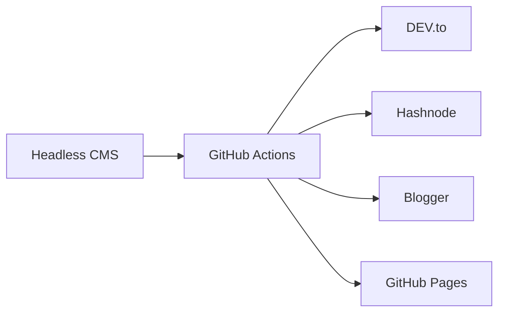

기술 블로그를 여러 플랫폼에 동시에 발행하면서 배운 자동화 패턴들을 정리했다. DEV.to, Hashnode, Blogger를 한번에 관리하는 워크플로우와 AI를 활용한 콘텐츠 생성 프로세스를 다룬다.

## 배경: 무엇을 만들고 있는가

개발 블로그를 운영하면서 콘텐츠를 여러 플랫폼에 배포해야 하는 상황이 생겼다. GitHub Pages를 메인으로 하되 DEV.to, Hashnode, Blogger에도 자동으로 발행하는 시스템을 구축했다. 

목표는 명확했다. 한번 글을 쓰면 모든 플랫폼에 자동 배포되고, 각 플랫폼별 메타데이터 관리도 자동화하는 것. 여기에 AI를 활용한 콘텐츠 생성과 빌드 로그 자동화까지 포함한다.

## GitHub Actions 워크플로우 설계 전략

### 플랫폼별 특성을 고려한 조건부 발행

각 플랫폼마다 다른 전략이 필요하다. 이를 GitHub Actions에서 어떻게 구조화했는지 보자.

```yaml
# .github/workflows/publish.yml
- name: Publish to DEV.to
  if: contains(steps.changed-files.outputs.all_changed_files, 'posts/') && 
      github.ref == 'refs/heads/main'
  run: |
    node scripts/publish-devto.js
```

핵심은 조건부 실행이다. 모든 글을 모든 플랫폼에 올리면 안 된다. 다음과 같이 분류했다:

- **DEV.to**: 기술 튜토리얼과 인사이트 글만
- **Hashnode**: 영어 글 전용  
- **Blogger**: 영어 글 + 인라인 CSS 적용

이를 프론트매터로 제어한다:

```markdown
---
published: true
platforms:
  devto: true
  hashnode: false
  blogger: true
language: en
---
```

### OAuth 토큰 갱신 자동화

Blogger API는 OAuth refresh token을 써야 한다. 매번 수동으로 갱신하면 워크플로우가 깨진다.

```javascript
// scripts/refresh-blogger-token.js
async function refreshToken() {
  const response = await fetch('https://oauth2.googleapis.com/token', {
    method: 'POST',
    headers: { 'Content-Type': 'application/x-www-form-urlencoded' },
    body: new URLSearchParams({
      client_id: process.env.GOOGLE_CLIENT_ID,
      client_secret: process.env.GOOGLE_CLIENT_SECRET,
      refresh_token: process.env.GOOGLE_REFRESH_TOKEN,
      grant_type: 'refresh_token'
    })
  });
  
  const { access_token } = await response.json();
  return access_token;
}
```

이 패턴의 핵심은 **토큰을 secrets에 저장하되, 갱신된 토큰을 다시 저장하지 않는다**는 것이다. refresh token은 계속 유효하므로 매번 새 access token만 발급받으면 된다.

### 발행 상태 추적과 중복 방지

같은 글을 여러 번 발행하면 안 된다. 각 플랫폼의 고유 ID를 프론트매터에 저장하는 방식을 썼다.

```javascript
// 발행 후 프론트매터 업데이트
const updatedFrontMatter = {
  ...frontMatter,
  devto_id: response.id,
  devto_url: response.url,
  published_at: new Date().toISOString()
};

await updateFrontMatter(filePath, updatedFrontMatter);
```

이렇게 하면 이미 발행된 글은 건너뛰고, 새 글만 발행한다. 워크플로우에서 이를 체크하는 로직:

```javascript
if (frontMatter.devto_id) {
  console.log(`Skipping ${filename} - already published to DEV.to`);
  continue;
}
```

## AI를 활용한 콘텐츠 생성 자동화

### 빌드 로그 자동 생성 프롬프트

매일 작업한 내용을 빌드 로그로 남기는데, 이를 수동으로 쓰면 시간이 너무 오래 걸린다. 커밋 데이터를 바탕으로 AI가 빌드 로그를 작성하게 했다.

효과적인 프롬프트 패턴:

> "다음 커밋 데이터를 바탕으로 개발 빌드 로그를 작성해줘. 기술적 세부사항보다는 **왜 이 작업을 했는지, 어떤 문제를 해결했는지**에 집중해. 개발자가 읽었을 때 인사이트를 얻을 수 있게 써줘.
>
> 제약 조건:
> - 커밋 메시지를 그대로 나열하지 마
> - 'chore:', 'fix:' 같은 prefix는 무시하고 본질만 추출해
> - 작업 간 연관성을 찾아서 스토리로 엮어줘
> - 분량은 800-1200자"

이렇게 쓰면 안 된다:

> "커밋 로그를 정리해줘"

차이는 **맥락과 제약 조건**이다. AI에게 단순한 작업을 시키면 단순한 결과가 나온다. 어떤 관점에서, 어떤 톤으로, 어떤 분량으로 써달라고 명확히 지시해야 한다.

### 영어 번역 자동화 프롬프트

한국어로 쓴 글을 영어로 번역할 때도 단순 번역이 아닌 **리라이팅**을 요청한다.

> "이 한국어 기술 블로그 포스트를 영어로 번역해줘. 직역하지 말고, 영어권 개발자가 읽기 자연스럽게 리라이팅해.
>
> 특히 신경써줘:
> - 한국어 특유의 에둘러 표현은 직설적으로 바꿔
> - 기술 용어는 번역하지 말고 원문 그대로 (commit, deploy, refactor 등)
> - 코드 예시와 명령어는 절대 건드리지 마
> - 제목은 SEO를 고려해서 키워드가 앞에 오게 재구성해"

결과적으로 번역본이 아닌 **영어 네이티브가 쓴 것 같은** 글이 나온다. 이는 해외 플랫폼에서 engagement를 높이는 데 중요하다.

## 멀티플랫폼 메타데이터 관리

### 플랫폼별 최적화 전략

각 플랫폼마다 다른 메타데이터가 필요하다. 이를 체계적으로 관리하는 방법:

```yaml
# 프론트매터 구조
---
title: "GitHub Actions로 멀티플랫폼 블로그 자동화"
description: "DEV.to, Hashnode, Blogger를 한번에 관리하는 워크플로우"
tags: ["github-actions", "automation", "blog", "devops"]
canonical_url: "https://blog.jidong.dev/github-actions-multi-platform"

# 플랫폼별 설정
devto:
  published: true
  series: "Blog Automation"
  
hashnode:
  published: true
  subtitle: "Complete guide to cross-platform publishing"
  
blogger:
  published: true
  apply_inline_css: true
---
```

이렇게 구조화하면 플랫폼별로 다른 최적화를 적용할 수 있다. Blogger는 인라인 CSS를 적용하고, Hashnode는 subtitle을 추가하는 식으로.

### 자동 태그 정규화

플랫폼마다 태그 규칙이 다르다. DEV.to는 소문자만, Hashnode는 camelCase를 선호한다. 이를 자동으로 변환한다:

```javascript
function normalizeTagsForPlatform(tags, platform) {
  const tagMap = {
    'github-actions': {
      devto: 'githubactions',
      hashnode: 'GitHubActions',
      blogger: 'GitHub Actions'
    },
    'nextjs': {
      devto: 'nextjs',
      hashnode: 'NextJS',  
      blogger: 'Next.js'
    }
  };
  
  return tags.map(tag => tagMap[tag]?.[platform] || tag);
}
```

이런 세부사항들이 누적되면 각 플랫폼에서 더 자연스러운 노출이 가능하다.

## 더 나은 방법은 없을까

현재 구현한 방식보다 개선할 수 있는 부분들이 있다:

### GitHub Apps를 활용한 더 안전한 인증

현재는 personal access token을 쓰고 있지만, GitHub Apps가 더 안전하다. 특히 organization에서 운영할 때는 필수다.

```yaml
- name: Generate GitHub App Token
  id: generate_token
  uses: tibdex/github-app-token@v1
  with:
    app_id: ${{ secrets.APP_ID }}
    private_key: ${{ secrets.APP_PRIVATE_KEY }}
```

GitHub Apps는 권한을 세밀하게 제어할 수 있고, 토큰 만료 관리도 자동화된다.

### Webhook 기반 실시간 동기화

현재는 push 이벤트에만 반응하지만, 더 정교한 동기화가 필요하다면 webhook을 활용할 수 있다. 특히 플랫폼에서 직접 수정한 내용을 GitHub로 다시 동기화하려면 필수다.

### Content Management System 도입 검토

콘텐츠 양이 늘어나면 Markdown 파일 관리만으로는 한계가 있다. Headless CMS (Contentful, Strapi)를 중간에 두고, 이를 source of truth로 만드는 것도 고려할 만하다.



이렇게 하면 웹 인터페이스로 글을 관리하면서도 Git 기반 워크플로우의 장점을 유지할 수 있다.

### AI 에이전트 활용한 콘텐츠 최적화

현재는 단순 번역/생성만 하지만, 각 플랫폼별 engagement 데이터를 학습한 AI 에이전트를 만들 수 있다. 예를 들어:

- DEV.to에서 잘 되는 제목 패턴 학습
- Hashnode에서 선호되는 태그 조합 분석  
- Blogger에서 SEO 최적화된 메타 디스크립션 생성

이를 위해서는 각 플랫폼의 Analytics API를 연동하고, 성과 데이터를 수집하는 파이프라인이 필요하다.

## 정리

- GitHub Actions로 멀티플랫폼 발행을 자동화하려면 각 플랫폼의 특성에 맞는 조건부 로직이 핵심이다
- OAuth 토큰 관리는 refresh token 패턴을 써서 완전 자동화할 수 있다  
- AI를 활용한 콘텐츠 생성에서는 구체적인 제약 조건과 맥락을 제공하는 것이 품질을 결정한다
- 프론트매터 기반 메타데이터 관리로 플랫폼별 최적화를 체계화할 수 있다

<details>
<summary>이번 작업의 커밋 로그</summary>

05e904e — post: build logs 2026-03-18 (2 posts, en)
4de9884 — post: build logs 2026-03-18 (2 posts, en)
2bb1330 — post: build logs 2026-03-18 (2 posts, en)
d455bdf — chore: update published articles [skip ci]
2ac70e2 — chore: update published articles [skip ci]
1a019c3 — post: build logs 2026-03-18 (2 posts, en)
8ae8059 — post: build log series (6 posts, en) + unpublish script
765902d — feat: Medium → Hashnode 워크플로우 교체 (영어 글 자동 발행)
cf8a33f — feat: Medium + Blogger 자동 발행 워크플로우 추가
6e951d4 — post: English versions for 8 Korean blog posts

</details>